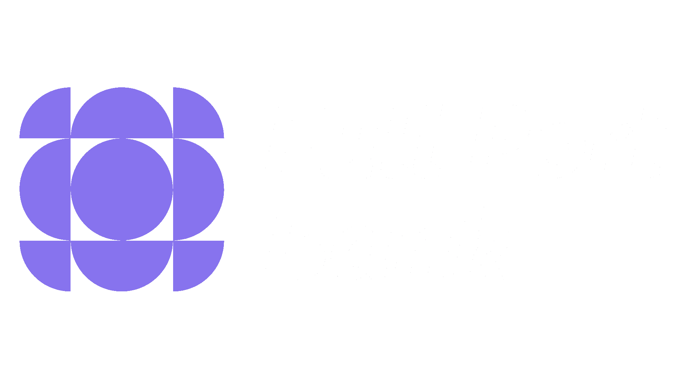

<div align="center">
  
<picture align="center">
  <source media="(prefers-color-scheme: dark)" srcset="logo-white.png">
  <source media="(prefers-color-scheme: light)" srcset="logo-black.png">
  
</picture>


<!-- TODO: Add live demo link if available -->
<!-- [Live Demo](https://demo-link.com) -->

**A modern, cross-platform mobile banking application frontend built with Ionic Vue and Capacitor.**


</div>

## 📖 Overview

The FPBank Frontend is a simulated banking mobile application developed as part of an academic project. It is a client-side application designed to demonstrate modern mobile and web application development practices within a banking-inspired context. Built using Vue.js 3 and the Ionic Framework, the application provides a responsive and intuitive user interface that can be deployed across multiple platforms—including iOS, Android, and the Web (PWA)—through Capacitor.

This project serves as a frontend prototype for typical banking workflows, allowing users to interact with simulated features such as account viewing and transaction-related interfaces. It connects to a separate backend API (also simulated) for data handling and transaction processing, focusing on architectural design, frontend-backend integration, and user experience rather than real financial operations.

**Tech Stack:**

          


## ✨ Features

🎯 **Cross-Platform Compatibility**: Deployable to iOS, Android, and Web (PWA) from a single codebase using Capacitor, demonstrating multi-platform development concepts.

📱 **Responsive & Modern UI**: Built with Ionic Framework’s UI components to ensure a consistent and mobile-friendly experience across devices.

🔗 **Simulated Banking Functionality**: Implements frontend interfaces for common banking operations (e.g., account management and transaction views) for educational and demonstration purposes only.

🛡️ **Type-Safe Development**: Uses TypeScript to promote code quality, maintainability, and safer development practices.

⚡ **Optimized Development Workflow**: Powered by Vite for fast hot-reload during development and efficient production builds.

🧪 **Testing-Oriented Setup**: Includes configurations for Unit Testing (Vitest) and End-to-End Testing (Cypress) to showcase testing methodologies in modern frontend projects.

🎨 **Vue 3 Composition API**: Leverages Vue 3’s Composition API for cleaner logic separation, scalable state handling, and improved code organization.

## 🚀 Quick Start

### Prerequisites
-   **Node.js**: `^18.0.0` or higher (check `package.json` `engines` if present, otherwise common versions)
-   **npm**: Comes with Node.js
-   **Capacitor CLI**: `npm install -g @capacitor/cli` (recommended for easier management)

### Installation

1.  **Clone the repository**
    ```bash
    git clone https://github.com/joshperegrin/fpbank-frontend.git
    cd fpbank-frontend
    ```

2.  **Install dependencies**
    ```bash
    npm install
    ```

3.  **Environment setup**
    Create a `.env` file in the project root based on common frontend environment variables.
    ```bash
    cp .env.example .env # If .env.example is provided, otherwise create manually
    ```
    Configure your environment variables, typically for API endpoint:
    ```ini
    VITE_API_BASE_URL="http://localhost:3000/api" # Replace with your actual backend API URL
    ```
    _Note: For Vite, environment variables must be prefixed with `VITE_` to be exposed to the client-side code._

### Start Development Server

Run the application in development mode for web:
```bash
npm run dev
```
Open your browser and visit `http://localhost:5173` (or the port indicated in your console).

### Running as a Mobile App (Capacitor)

1.  **Build the web application**
    ```bash
    npm run build
    ```

2.  **Add desired native platforms**
    ```bash
    npx cap add ios
    npx cap add android
    ```

3.  **Copy web assets to native projects and open IDE**
    ```bash
    npx cap sync
    npx cap open ios   # Opens Xcode for iOS development
    npx cap open android # Opens Android Studio for Android development
    ```
    From the respective IDEs (Xcode or Android Studio), you can run the application on an emulator or a connected device.

## 📁 Project Structure

```
fpbank-frontend/
├── public/                 # Static assets (e.g., index.html, favicons)
├── src/                    # Source code for the application
│   ├── assets/             # Global styles, images, fonts
│   ├── components/         # Reusable Vue components
│   ├── composables/        # Vue 3 Composition API functions (custom hooks)
│   ├── router/             # Vue Router configuration and route definitions
│   ├── stores/             # Pinia state management modules
│   ├── views/              # Main application views/pages
│   ├── App.vue             # Root Vue component
│   └── main.ts             # Application entry point
├── tests/                  # Test files for unit and E2E testing
│   ├── e2e/                # Cypress End-to-End test suites
│   └── unit/               # Vitest Unit test files
├── index.html              # Main HTML file for the web application
├── ...                     # Other Configuration Files

```
## 🧪 Testing

The project is configured for both unit and end-to-end testing.

### Unit Tests (Vitest)
Unit tests are written using Vitest.

```bash

# Run all unit tests
npm run test:unit
```

### End-to-End Tests (Cypress)
End-to-end tests are handled by Cypress.

```bash

# Open the Cypress test runner UI
npm run test:e2e

# Run Cypress tests headlessly

# npx cypress run (customize as needed based on cypress.config.ts)
```

## 🚀 Deployment

### Production Build
To create a production-ready build of the web application:
```bash
npm run build
```
This command will compile and optimize the application, outputting the static files to the `dist/` directory. These files can then be deployed to any static web host (e.g., Netlify, Vercel, GitHub Pages).

### Mobile App Deployment (Capacitor)
For deploying to iOS and Android app stores, follow these steps after building the web app (`npm run build`):

1.  **Sync to Native Projects:**
    ```bash
    npx cap sync
    ```
2.  **Build Native Projects:**
    *   **iOS:** Open `npx cap open ios` in Xcode, then build and archive for App Store submission.
    *   **Android:** Open `npx cap open android` in Android Studio, then generate a signed APK/App Bundle for Google Play Store submission.
---

<div align="center">

**⭐ Star this repo if you find it helpful!**

Made with ❤️ by [joshperegrin](https://github.com/joshperegrin)

</div>


